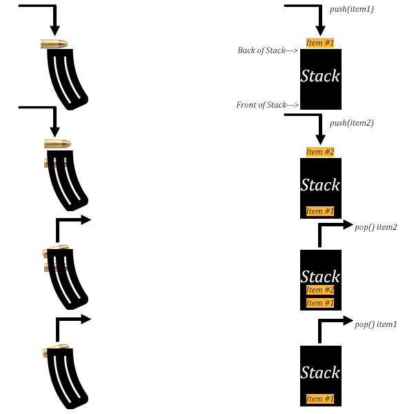

# Stack

## Introduction

What is a stack? One of the most common stacks you've probably used is the Undo function on Word or a similar text editing program. 

The undo function works like the bullets in a magazine. You place the first bullet into the magazine followed by the second bullet. When it comes time to load a bullet into the chamber of the gun, which bullet is loaded? Bullet #2. Now only Bullet #1 remains in the magazine. Suppose you place Bullet #3 into the magazine, your magazine now has #1 on bottom and #3 on top. What order would they enter the chamber of the gun? #3 first followed by #1.

How is the Undo function similar? The changes you make to the document are saved temporarily in a stack, when you hit "undo" the last change made is taken off the top of the stack, making the item just below it the new top of the stack. The document is now reverted to the state it was in according to the new top item of the stack.

***

## LIFO

A common acronym to describe this behavior is LIFO. It stands for Last In, First Out. This means that the last item to be entered will be the first to leave, aka the top of the stack. You cannot take a bullet out from the middle or bottom of the magazine, only the top. This is LIFO behavior.

***

## Illustrations & Operation Table

In the example of the magazine, bullets are inserted and removed through the top and the oldest bullet is found on the bottom. With stack terminology, the front of the stack is where the oldest item resides and you push items onto or pop items off at the back of the stack.



| Common Stack Operation | Description | Python Code | Performance |
| ----------------------- | ----------- | ----------- | ----------- |
| push(value)             | Adds value to the back of the stack | my_stack.append(value) | O(1) - Performance of adding to the end of a dynamic array |
| pop() | Removes and returns the item from the back of the stack. | value = my_stack.pop() | O(1) - Performance of removing from the end of a dynamic array |
| size() | Return the size of the stack. | length = len(my_stack) | O(1) - Performance of returning the size of the dynamic array |
| empty() | Returns true if the length of the stack is zero. | if len(my_stack) == 0: | O(1) - Performance of checking the size of the dynamic array |

***

## Example

### Using Stacks with Yu-gi-oh!

In Yu-gi-oh!, a trading card game, you can retaliate against your opponent who can then react to your retaliation. As the players have this back-and-forth reaction to each other’s cards, it starts what is called a Chain (like a chain of events.) The card activated last is evaluated first, and the card activated first is evaluated last. This is a perfect opportunity to use a stack given the LIFO behavior of a Chain.

### Create a Stack for the Following Scenario

There are two players, player 1 and player 2. Player 1 is going to try and summon a monster, but player 2 is going to try and prevent that from happening. The two players keep bouncing back and forth activating cards and have thus created a Chain. The following table shows the cards being used.

| Card Title | Results of Activation |
| ---------- | --------------------- |
| Giant Soldier of Stone | This monster card is successfully summoned to the field |
| Trap Hole | When your opponent Normal or Flip Summons a monster with 1000 or more ATK: Target that monster; destroy that target. |
| Mystical Space Typhoon | Target 1 Spell/Trap Card on the field; destroy that target. |
| Curse of Royal | Negate the activation of a Spell or Trap Card that includes the effect of destroying 1 Spell or Trap Card and destroy it. |

The Chain you will reference when creating your stack is as follows:

Player 1 attempts to summon Giant soldier of Stone


Player 2 tries to destroy the Giant Soldier with Trap Hole


Player 1 attempts to destroy Trap Hole with Mystical Space Typhoon


Player 2 retaliates with a Mystical Space Typhoon of their own, bent on destroying the first


Finally, player 1 plays Curse of Royal in an attempt to destroy player 2's Mystical Space Typhoon


Now that the situation has been explained, let's go over the following requirements. 

* Create a card class that has two member variables: card_title and card_activation. 

* Create instances of the card class for each of the cards played in the Chain shown above. 

* Add them to a stack in the correct order. 

* Finally print how many links are in the chain, i.e. how many items are in your stack.

### Solution

Set up your Card Class:

```
class Card:
    card_title = None
    card_activation = None
```

Now create instances for each card.

Giant Soldier of Stone:

```
giant_soldier_of_stone = Card()

giant_soldier_of_stone.card_title = "Giant Soldier of Stone"
giant_soldier_of_stone.card_activation = "This monster card is successfully summoned to the field"
```

Trap Hole:

```
trap_hole = Card()

trap_hole.card_title = "Trap Hole"
trap_hole.card_activation = "When your opponent Normal or Flip Summons a monster with 1000 or more ATK: Target that monster; destroy that target."
```

Player 1 Mystical Space Typhoon:

```
mystical_space_typhoon1 = Card()

mystical_space_typhoon1.card_title = "Mystical Space Typhoon"
mystical_space_typhoon1.card_activation = "Target 1 Spell/Trap Card on the field; destroy that target."
```

Player 2 Mystical Space Typhoon:

```
mystical_space_typhoon2 = Card()

mystical_space_typhoon2.card_title = "Mystical Space Typhoon"
mystical_space_typhoon2.card_activation = "Target 1 Spell/Trap Card on the field; destroy that target."
```

Curse of Royal:

```
curse_of_royal = Card()

curse_of_royal.card_title = "Curse of Royal"
curse_of_royal.card_activation = "Negate the activation of a Spell or Trap Card that includes the effect of destroying 1 Spell or Trap Card and destroy it."
```

Now it is time to add the cards to a stack:

```
chain = []
chain.append(giant_soldier_of_stone)
chain.append(trap_hole)
chain.append(mystical_space_typhoon1)
chain.append(mystical_space_typhoon2)
chain.append(curse_of_royal)
```

Finally, lets print how many links are in our chain:

```
print(f"Total links in Chain: {len(chain)}")
```

***

## Problem to Solve

Is the Giant Soldier of Stone successfully summoned? Or will Trap Hole gobble him up after all? 

Do the following:

* Pop items off of the stack to activate them. When activating a card, print its card_title and card_activation

* If a card destroys another card, pop the destroyed card off of the stack and print only its card_title and that it was destroyed.

* After all cards have been activated or destroyed, check to see if the stack is empty. If so, print "Chain Complete!"

add link to solution here

***

## Link to Home Page

[Return Home](https://github.com/Scorpio-555/cse-212-Final-Project/blob/main/00Welcome.md).
