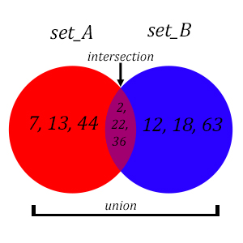
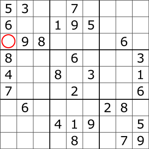
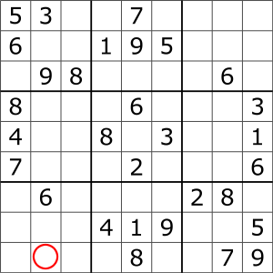

# Set

## Introduction

Now let’s talk about sets. What is the number one defining attribute of a set? Each entry in a set is unique. If a set of numbers already has 2, 3 and 4, trying to add another 2 will not alter the set whatsoever. It will still contain three entries: 2, 3 and 4. So what would an example of a set be? Well, what about a list containing all the current Social Security Numbers belonging to current citizens of the United States, that would be a set now wouldn't it? There would be no duplicates in that list, all SSN's would be unique.

But what else is different about sets? Stacks care about the order in which things are inserted and deleted, making sure that it fulfills the LIFO behavior that it is meant to exhibit. But sets don't care about the order in which things are added and deleted. But since everything in a set must be unique, every time we go to add something to a set there will be a check to see if the item being inserted already exists in the list. To be able to perform the tasks of adding, removing and testing for membership in O(1) time, sets implement something called hashing.

***

## Hashing

What is hashing? It is an algorithm that takes an input and converts it into fixed size string or number that has been formatted, in the case of sets, for optimal look-up capabilities. If we made it so that each number of a set was inserted at an index that matched its value, the search time would be O(1). If I added 2 and 5 to a blank set, it might look like this:

| _ | _ | 2 | _ | _ | 5 |

The problem comes into play when you want to add large numbers. Suppose you add 2 and 100,000 to and empty set. The size of the set would quickly get out of hand, and there would be a lot of wasted space.

| _ | _ | 2 | _ | _ | _ | _ | _ | _ | _ | _ | _ | _ | . . . | 100,000 | 

So, to fix this you could hash the input using the modulo operator. If An input was placed at an index determined by % 10, adding 2 and 100,000 to an empty set would be as follows:

| 100,000 | _ | 2 |

What happens if we tried to add 10 to the set? We already have a value at index 0 which is where 10 wants to go. Some solutions are to find the next available index to the right (open addressing), or just make a list that resides at index 0 which holds both 10 and 100,000(chaining). Instead of determining the index by % 10, we can evaluate instead based off of the modulo of the size of our sparse list. But if you have to sidestep a lot of times for open addressing, or your lists get really large for chaining, we might lose the effectiveness of O(1) performance. In order to maintain O(1) performance, we increase the size of the set and the reposition and rehash the values so that the entries are better distributed. 

***

## Intersection and Union

Some of the operations sets can perform are intersection and union. Suppose I have set_A that contains the following values:

| 2 | 7 | 13 | 22 | 36 | 44 |

and I have another set, set_B, as follows:

| 2 | 12 | 18 | 22 | 36 | 63 |

The union of set_A and set_B is:

| 2 | 7 | 12 | 13 | 18 | 22 | 36 | 44 | 63 |

and the intersection of set_A and set_B is:

| 2 | 22 | 36 |

Intersection is what values the two sets have in common and union is combining all the values of the two sets.

***

## Illustrations and Set operations table



| Common Set Operation | Description | Python Code | Performance |
| ----------------------- | ----------- | ----------- | ----------- |
| add(value)             | Adds "value" to the set | my_set.add(value) | O(1) - Performance of hashing the value (assuming good conflict resolution) |
| remove(value) | Removes the "value" from the set | my_set.remove(value) | O(1) - Performance of hashing the value (assuming good conflict resolution) |
| member(value) | Determines if "value" is in the set | if value in my_set: | O(1) - Performance of hashing the value (assuming good conflict resolution) |
| size() | Returns the number of items in the set | length = len(my_set) | O(1) - Performance of returning the size of the set |

***

## Example

### Using Sets for Sudoku



Let's say that we want to use sets to help us solve sudoku puzzles. Right now, we are only testing if we can enter a valid guess into a single square, in this case the square in the image above that has been circled in red. 

In sudoku, the numbers 1 - 9 can only show up once in each row, column and 3x3 block. For this example problem, we will consider the following

* How could you implement sets to represent the row, column and block that the circled square resides in?

* How might we print off all the current possibilities that we could enter into the circled square?

### Solution

Let us make three sets, one for the row, one for the column, and one for the block that the focus square resides in.

```
row_set = {9, 8, 6}

column_set = {5, 6, 8, 4, 7}

block_set = {5, 3, 6, 9, 8}
```

Now, we have successfully completed the first bullet point. We have used sets to represent row, column and block. Next, we will work on printing off the available numbers we could enter into the focus square.

Let’s make a set containing the numbers one through nine, since those are the only numbers that show up in a sudoku puzzle. Then, let's make a set that contains the numbers found in the row, column and block combined since we will not be able to use them.

```
one_thru_nine = {1, 2, 3, 4, 5, 6, 7, 8, 9}

numbers_used = row_set.union(column_set)
numbers_used = numbers_used.union(block_set)
```

At this point, we are very close. Currently we have a set containing all the numbers we can't use. But we want to print the numbers we can use. Let’s use set one_thru_nine and set numbers_used and find all the numbers that they do not have in common. We achieve this with the function symmetric_difference(). To learn more, follow [this link](https://www.programiz.com/python-programming/methods/set/symmetric_difference).

```
numbers_available = one_thru_nine.symmetric_difference(numbers_used)

print(numbers_available)
```

Perfect! Now we are all finished with the example problem. The numbers available to insert into the focus square should be 1 and 2.

***

## Problem to Solve



Now using the new square circled in the image above, do the following.

* Create sets for the row, column and block that the new focus square resides in as demonstrated in the example problem.

* Prompt the user to enter a number 1 - 9

* If the number is valid, inform the user that the number has been added and then print the row, column and block showing that they now contain the user input.

* Finally, if the number is not valid, inform the user why there was a conflict i.e., if the row, column and/or block already contains the number.

***

## Link back to home page

[Return Home](https://github.com/Scorpio-555/cse-212-Final-Project/blob/main/00Welcome.md).
