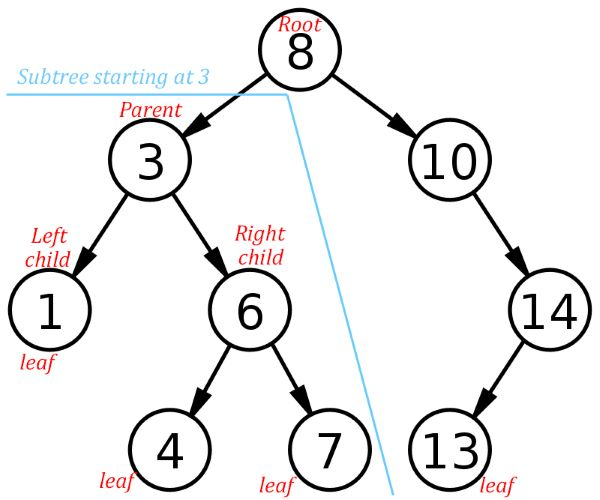

# Binary Search Tree

## Introduction

For this data structure we will need to define the three words that make up its name. Let's start with the word "Tree." If you are familiar with a linked list data structure, trees have some similarities. Linked lists are like a chain, there are nodes or containers where the data lives and to get to the next node you follow the chain link that connects to it. Trees are similar in that they have nodes that are linked, but linked lists are perfectly linear in the sense that you can only go up or down the chain (generally called previous and next.) But with trees, connections that look like branches split off of a single node that lead to several other nodes. 

Now let's talk about the second word in this data structure's name. The word "Binary" means that each node that houses data can't branch out and connect to more than two other nodes. We refer to this relationship in terms of parent and child. A node can have up to two children max, a right child and a left child. If a node has one or two children it is a parent of those nodes. Children nodes can in turn have their own children and are considered the parent of their children. Only one node doesn't have a parent, and that is the root node (think of it as the trunk of the tree.) The nodes on the fringes of the tree that do not have any children yet are called leaf nodes.

Finally, let's talk about the word "Search." Search means that there is a method used to determine where new nodes should be added. The method of insertion lends itself to being easily searched. If there is no root node, the node being added becomes the root. But if the root does exist, let's say it contains an integer value equal to 5. If you want to add a new node with the value of 3, we will make it a left child to the root since 3 is less than 5. Now if we want to add the number 6, it will be the right child of the root since 6 is greater than 5. If we add the number 4 to the tree, it is less that 5, so we will check in the direction of the left child which is 3. Since 4 is bigger than 3, it will become the right child to the node that houses the number 3.

***

## Recursion

Due to the non-linear nature of a Binary Search Tree (or BST for short,) in order to navigate the data structure we will need to use a technique known as recursion. Suppose you wanted a function that took a "count" parameter and printed out "hello" a number of times equal to "count." To accomplish this you might use a loop and call your function loop_hello:

```
def loop_hello(count):
    for i in range(count):
        print("Hello")
```

If you make a function call and pass the number 5 as a parameter, it would look like this:

```
loop_hello(5)
```

Output:

```
Hello
Hello
Hello
Hello
Hello
```

Now that we've used a loop to accomplish our goal, let's use recursion instead. We'll call the function recursive_hello. As you will see in the following example, recursion means that a function calls itself:

```
def recursive_hello(count):
    if count <= 0:                  #<--- We call this a base case
        return
    
    print("Hello")                  #Simply printing hello
    recursive_hello(count - 1)      #This is a recursive call where recursive_hello calls itself
```

Output:

```
Hello
Hello
Hello
Hello
Hello
```

When checking to see if the count is less than or equal to 0, we ```return``` without doing anything. We call this a base case where the cycle of recursion is broken. Have you ever taken two smart phones and turned their cameras to selfie mode and then had them face each other? Or maybe had two mirrors face each other? Or perhaps you've seen the movie "Inception" where the characters dive into dreams within a dream. The base case is like a "kick" in the movie that bumps you out of a lower dream level and up to a higher level. Let's see how many levels our recursive_hello dives into when we use the number 5. Note - the following is meant to simply be an illustration of how the computer navigates a recursive funtion, the illustration below will produce errors if you try to copy it into an IDE:

```
recursive_hello(5): #Original Call
    if 5 <= 0:
        return
    
    print("Hello")
    recursive_hello(5 - 1): #Dive Down to Level 1
        if 4 <= 0:
            return
    
        print("Hello")
        recursive_hello(4 - 1): #Level 2
            if 3 <= 0:
                return
    
            print("Hello")
            recursive_hello(3 - 1): #Level 3
                if 2 <= 0:
                    return
    
                print("Hello")
                recursive_hello(2 - 1): #Level 4
                    if 1 <= 0:
                        return
    
                    print("Hello")
                    recursive_hello(1 - 1): #Level 5
                        if 0 <= 0:
                            return  #<-- Base Case Hit! Bump up to Level 4
    
                        print("Hello")          #This Code isn't reached
                        recursive_hello(0 - 1)  #This Code isn't reached
                    
                    #No more code for Level 4, bump up to Level 3
                #No more code for Level 3, bump up to Level 2
            #No more code for Level 2, bump up to Level 1
        #No more code for Level 1, bump up to Original call
    #No more code for Original call, leave function entirely
```

### Warning!

Notice how the recursive call has a parameter of "count - 1"? This ensures that the base case is eventually reached!!! If you do not have a base case, or you have one but it cannot be reached, your function will run forever calling itself over and over again. Using the metaphor of "Inception," this is like diving so far that you are eternallly stuck in Limbo. You will receive the following error:

```
RecursionError: maximum recursion depth exceeded while calling a Python object
```

***

## Insertion and Traversing BST’s

These two operations are recursive. 

### Insertion:

The first node passed to the insertion function is the root

* Check if the number to be added is less than the current node's value
    - If the left child doesn't exist: Yay! We found an open spot, go ahead and add the new node as a left child
    - If the left child does exist: We need to keep looking, make a recursive call passing in the left child
* Else if the number is greater than the current node's value
    - If the right child doesn't exist: Yay! We found an open spot, go ahead and add the new node as a right child
    - If the right child does exist: We need to keep looking, make a recursive call passing in the right child

Not that for this tutorial, duplicates aren't supported. If you are attemping to insert a node of value 5 and you reach an existing node of value 5, the insertion function will not activate the if statement nor will it activate the ```elif``` statement and the duplicate value will not be inserted.

### Traversing:

This tutorial has the forward traversing functions support the ```in``` function in python. For example:

```
for value in my_bst:
    print(value)
```

This is done by defining the ```__iter__ ``` function as a [Generator Function](https://wiki.python.org/moin/Generators) for the _traverse_forward function. In a nut shell, generator functions iterate through something and can use the ```yeild``` keyword as a substitute for the ```return``` keyword. So ```__iter__ ``` will ```yeild from``` the _traverse_forward function passing in the root node so that we start at the root (as always.)

_taverse_forward:

* If the current node exists, i.e. ```node is not None```
    - ```yeild from``` a recursive call to _traverse_forward passing in left child
    - ```yeild``` the data of the current node
    - ```yeild from``` a recursive call to _traverse_forward passing in right child

This allows you to print each value of the BST and it will automatically be presented in order of least to greatest.

__Pop Quiz:__ Can you point out the base case for the insertion function? How about the _traverse_forward function? To check your answer, see the ```#Comment Code``` found in the [Example](#example) Problem.

***

## Illustration and Operation Table



Using the image above, where would the number 5 go? How about 9? __Answer__: 5 would become the right child to 4, and 9 would become the left child to 10.

The other data structures show the associated python code in the operation table. With stack we could use a list to perform LIFO behavior with the code ```my_stack = [item1, item2]```. With set there is a built in set object we utilized using the following code: ```my_set = {item1, item2}```. But for BST, we have to write a ```class BST``` from scratch. For this reason the BST operation table does not have a "Python Code" column. You might wonder, "Why on earth would I want to go through all the trouble of using a BST?" One reason is the performance of the BST search function. To search through an unordered list, the performance would be O(n), but with BST, each node rules out half of each resulting subtree. This yeilds a performance of O(log n).

| Common BST Operation | Description | Performance |
| -------------------- | ----------- | ----------- | 
| insert(value) | Insert a value into the tree. | O(log n) - Recursively search the subtrees to find the next available spot |
| remove(value) | Remove a value from the tree. | O(log n) - Recursively search the subtrees to find the value and then remove it. This will require some cleanup of the adjacent nodes. |
| contains(value) | Determine if a value is in the tree. | O(log n) - Recursively search the subtrees to find the value. |
| traverse_forward | Visit all objects from smallest to largest. | O(n) - Recursively traverse the left subtree and then the right subtree. |
| size() | Return the size of the BST. | O(1) - The size is maintained within the BST class. |
| empty() | Returns true if the root node is empty. This can also be done by checking the size for 0. | O(1) - The comparison of the root node or the size. |

***

## Example

Because there are _so_ many new concepts to consider with BST's, this example problem will provide a BST class with a child class called Node, as well as define the insertion, deletion, and traversal functions. This will give you a really nice foundation to build from when completing the Problem to Solve.

### Scenario:

Let's say you get highed on as a software engineer for an elementary school. Faculty want you to right a program that can create a class roster for them. The user types in names, and your program will save those names in alphabetical order. You will use a BST to do this. Here is the layout you come up with:

```
class BST:
    
    class Node:
        
        def __init__(self, data):
            #When creating a node we set its data
            #But we will set the pointers to left & right child later
            self.data = data
            self.left = None
            self.right = None

    def __init__(self):
        #We start off with an empty BST with no root
        self.root = None

    def standardize_name(self, name):
        # If the user inputs a name in the format of "First Last"
        # this function will reformat it as "Last, First"
        pass

    def insert(self, data):
        #If the BST is empty, we will make a root to hold "data"
        #Otherwise we will call the recursive function _insert()
        pass

    def _insert(self, data, node):
        #This will recursively look for an empty spot to add in a new node
        pass
    
    def __iter__(self):
        #this will yeild from_traverse_forward() starting at the root
        pass
        
    def _traverse_forward(self, node):
        #this will yeild the contents of BST from least to greatest
        pass

    def delete(self, data):
        #If the BST is not empty, we will call the recursive function _delete()
        pass
    
    def _delete(self, data):
        #This will recursively search for "data" and delete the node containing it
        #Some clean-up of the subtree below the deleted node will be required
        pass
```

Now that you have an idea of what you want your code to look like, you start filling in those functions you've outlined. The standardize_name function is unique to our specific problem and isn't actually a core feature of BST's in general. The delete function is probably the hardest of all functions to wrap your mind around with BST. They are not shown here, they are shown in the [Starter Code](Starter-Code-BST.py) of the [Problem to Solve](#problem-to-solve).

Insert:

```
def insert(self, data):
    data = self.standardize_name(data)

    if self.root is None:
        self.root = BST.Node(data)
    else:
        self._insert(data, self.root)  # Start at the root
```

The recursive function _insert:

```
if data < node.data:
            # The data belongs on the left side.
            if node.left is None:
                # We found an empty spot, this acts as a BASE CASE with no further recursion
                node.left = BST.Node(data)
            else:
                # Need to keep looking.  Call _insert recursively on the left sub-tree.
                self._insert(data, node.left)
        elif data > node.data:
            # The data belongs on the right side.
            if node.right is None:
                # We found an empty spot, this acts as a BASE CASE with no further recursion
                node.right = BST.Node(data)
            else:
                # Need to keep looking.  Call _insert recursively on the right sub-tree.
                self._insert(data, node.right)
```

Iteration:

```
def __iter__(self):
    yield from self._traverse_forward(self.root)  # Start at the root
```

The recursive function _traverse_forward:

```
def _traverse_forward(self, node):
    if node is not None:
        yield from self._traverse_forward(node.left)
        yield node.data
        yield from self._traverse_forward(node.right)
```

Now your code is in a super solid starting place, teachers can add names, delete names and print off the class roster in alphabetical order!

Here is a sample of your initial code in action:

```
roster = BST()
roster.insert("John Doe")
roster.insert("Jessica Jones")
roster.insert("Name to Delete")
roster.insert("Brad Smith")
roster.insert("Rebecca Jones")
roster.insert("Owen Kennedy")
roster.insert("Dan Zimmer")

for name in roster:
    print(name)

print("\nNow delete an entry:\n")

roster.delete("Name to Delete")

for name in roster:
    print(name)
```

Output:

```
Delete, Name To
Doe, John
Jones, Jessica      
Jones, Rebecca      
Kennedy, Owen       
Smith, Brad
Zimmer, Dan

Now delete an entry:

Doe, John
Jones, Jessica      
Jones, Rebecca      
Kennedy, Owen       
Smith, Brad
Zimmer, Dan
```

***

## Problem to Solve

Teachers are super happy that they can add and delete names as well as print off their class roster in alphabetical order. But the principle has also been using your code for the names of all the children in the school. She would really like to know how many kids go to the school without counting each individual name. She would also like to search the roster to see if a student is enrolled at the school.

Do the following:

* Navigate to the [Starter Code](Starter-Code-BST.py)
* Fill in the get_size() function
* Fill in the _contains() function
* Check to see that all tests pass

For get_size() to work properly you will need to slightly adjust insert(), _insert() and _delete(). Remember that calling the size() function should perform at O(1) which means you will be adding a ```size``` member variable that will contain an integer. Try to increment/decrement the ```size``` at the exact moment a node is being created or destroyed. This being said, in the function _delete() there is a case for nodes that have two children, which will not behave the same way the other cases do.

For the _contains() function, you will have a base case that returns ```True``` and a base case that returns ```False```. When making a recursion call, make sure to use the ```return``` keyword!

```
def _contains(self, data, node):
    If base case 1:
        return True
    
    If base case 2:
        return False

    return self._contains(...put parameters here...)
```

[View Solution](06Solution-BST.py)

***

## Link to Home Page

[Return Home](00Welcome.md)
